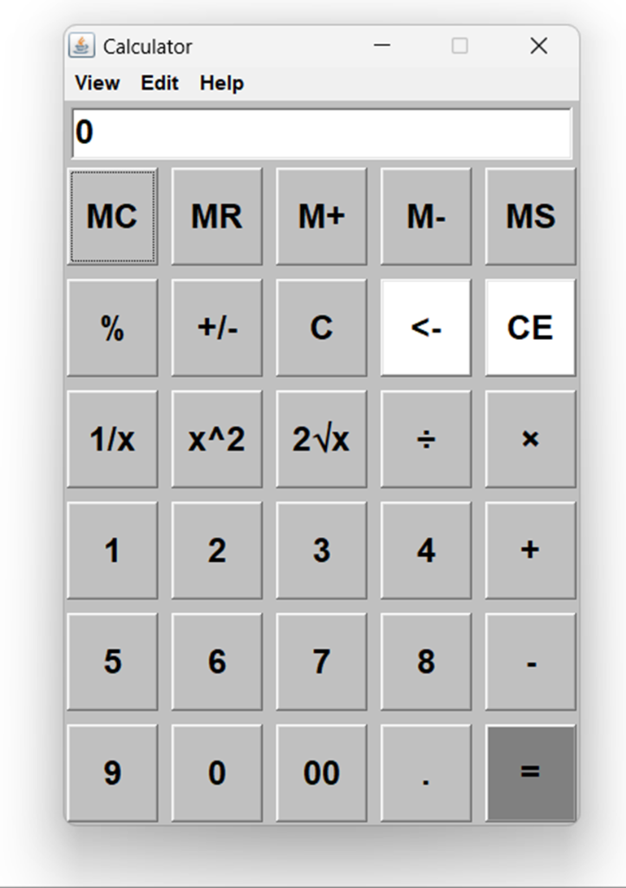

# 🧮 Java AWT Calculator

A sleek, lightweight desktop calculator application built using the **Java Abstract Window Toolkit (AWT)**. This repository contains the complete implementation of a GUI-based calculator that mimics standard hardware calculators, complete with a clean grid layout, advanced mathematical functions, a multi-tier menu system, and event handling.

## 📱 Application Preview

Here is a preview of the calculator interface in action, showing the beautiful Palatino Linotype font and standard grid layout:

<p align="center">
  
</p>

---

## ✨ Features

- **Standard Arithmetic**: Addition (`+`), Subtraction (`-`), Multiplication (`×`), and Division (`÷`).
- **Advanced Operations**:
  - **Square (`x²`)**: Computes the square of the entered number.
  - **Square Root (`2√x`)**: Computes the square root of the entered number.
  - **Reciprocal (`1/x`)**: Computes the reciprocal of the entered number.
  - **Negation (`+/-`)**: Toggles the number between positive and negative.
  - **Percentage (`%`)**: Standard percentage operations.
- **Entry & Navigation Controls**:
  - `C`: Clears the entire current calculation.
  - `CE`: Resets the display to `0`.
  - `<-`: Backspace key to remove the last typed character.
  - `00` & `.`: Fast input buttons for currency or precise decimal inputs.
- **Interactive UI**:
  - Clean AWT Grid Layout (`6` rows × `5` columns).
  - Custom font styles using `Palatino Linotype`.
  - Standard top Menu Bar (`View`, `Edit`, `Help`).

---

## 🛠️ Requirements

- **Java Development Kit (JDK)**: Version 8 or higher.
- **Operating System**: Platform-independent (runs on Windows, macOS, and Linux).

---

## 🚀 How to Run

Follow these quick steps to compile and launch the application:

### 1. Compile the Code
Open your terminal/command prompt in the directory containing `Calculator.java` and run:
```bash
javac Calculator.java
```
This compiles the code and generates the class files:
- `Calculator.class` (the main class)
- `Cal.class` (the calculator UI and logic)
- `Close.class` (the window event handler)

### 2. Run the Application
Execute the following command to launch the calculator:
```bash
java Calculator
```

---

## 📂 Project Structure

- **`Calculator.java`**: The complete source code of the project.
  - **`Calculator`**: Main entry class containing the `main` method.
  - **`Cal`**: Handles UI construction (Frames, Panels, Buttons, Menus) and event routing via `ActionListener`.
  - **`Close`**: Handles the window close event to ensure the program exits cleanly when the user clicks the window's close button.

---

## 🎨 Future Enhancements

- Fully implement the memory register functions (`MC`, `MR`, `M+`, `M-`, `MS`).
- Enhance color schemes and transition animations using Java Swing or JavaFX.
- Add support for keyboard bindings for numerical inputs and operators.

## creator
Ashini Sudusingha
Full-Stack Software Engineer & Designer
This project was completed when I was in first year(2024) Passionate about creating modern, beautifully aesthetic, and highly functional web solutions.
